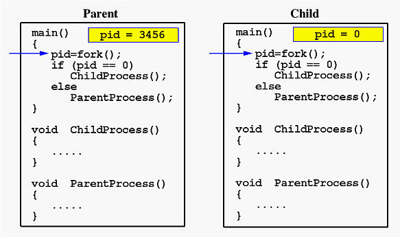

# C (System Calls)

This folder contains summaries, overviews and examples on how to program, write and use system calls. Most of the examples are tested on a fedora and the WSL (Bash on windows) as a way of testing it on windows. Please note that every example should work on whatever system you're on. Only the names and implemenations of the calls themselves might differ. Always use the man-pages to implement them.

 
With gitbook-plugin-ace code snippets will be displayed as followed:


// This is a hello world program for C.
#include <stdio.h>

int main(){
  printf("Hello World!");
  return 1;
}



 

Images will have a nice caption thanks to the image-captions plugin:

