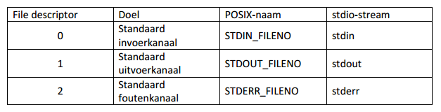

# Labo C 

Summary of C exercises of the labs. The first sections follow the exercise pdf (hints & tricks). The following sections summarise used principles.

## Introduction

### GUI vs no-GUI

When logging in to a linux machine most modern (desktop) distributions give a GUI (graphical user interface). You do have however the chance to change to one of the textual consoles with CTRL-ALT-F1, CTRL-ALT-F2, ... Fedora puts the GUI on the first terminal, while Ubuntu for example puts it on the seventh.

### Terminal shortcuts

An interesting command to see which shortcuts you can use in the terminal is: 

```sh
stty -a
```

### Manuals

Todo
(hints & tips)


## Compiling in the Shell

Todo
(compiler opties en dergelijke overzicht maken)


## Profiler Programs

Todo
- Valgrind
- Strace

### Lspci example

Todo

## I/O-System Calls

All system calls that need a pointer to an open file make use of a **file descriptor**. When a program is started, three file descriptors automatically are inherited from the shell: **the standard in (0), standard out (1) and standard error (2)**.




| Command                            | Purpose                               | Man-page              |
|:-----------------------------------|:--------------------------------------|:----------------------|
| ``open(pathname, flags, mode)``    | Opening a file                        | man 2 open            |
| ``read(fd, buffer, count)``        | Reading a file descriptor             | man 2 read            |
| ``write(fd, buffer, count)``       | Writing to a file descriptor          | man 2 write           |
| ``close(fd)``                      | Closing a file descriptor             | man 2 close           |
| ``unlink(pathname)``               | Deleting a file                       | man 2 unlink          |
| ``stat(path, buf)``                | Get file status                       | man 2 stat            |
| ``_exit(status)``                  | Terminate calling process             | man 2 exit            |


## Processen en POSIX-threads


| Command                              | Purpose                               | Man-page              |
|:-------------------------------------|:--------------------------------------|:----------------------|
| ``fork()``                           | Create child proces                   | man fork              |
| ``getpid()``                         | Get proces-ID                         | man getpid            |
| ``execve(filename, argv[], envp[])`` | Execute a program                     | man execve            |
| ``waitid(P_ALL, pid, NULL, WEXITED)``| Wait for process to change state      | man waitid            |
| ``pipe(int fd[2])``                  | Create a pipe                         | man pipe              |
| ``pthread_create(...)``              | Create a new thread                   | man pthread_create    |
| ``pthread_join(...)``                | Join with a terminated thread         | man pthread_join      |
| ``mmap(...)``                        | Map files or devices into memory      | man mmap              |
| ``munmap(...)``                      | Unmap files or devices into memory    | man mmap              |
| ``sem_wait(sem)``                    | Lock semaphore                        | man sem_wait          |


### Mutex

```sh
pthread_mutex_t mtx = PTHREAD_MUTEX_INITIALIZER;

int pthread_mutex_lock(pthread_mutex_t * mutex);
int pthread_mutex_unlock(pthread_mutex_t * mutex); 

```

### Posix semaforen

```sh
#include <semaphore.h>
int sem_init(sem_t *sem, int pshared, unsigned int value);

int sem_wait(sem_t *sem);
int sem_post(sem_t *sem);

int sem_destroy(sem_t *sem);

```

### Shared memory

Zie mmap en munmap
